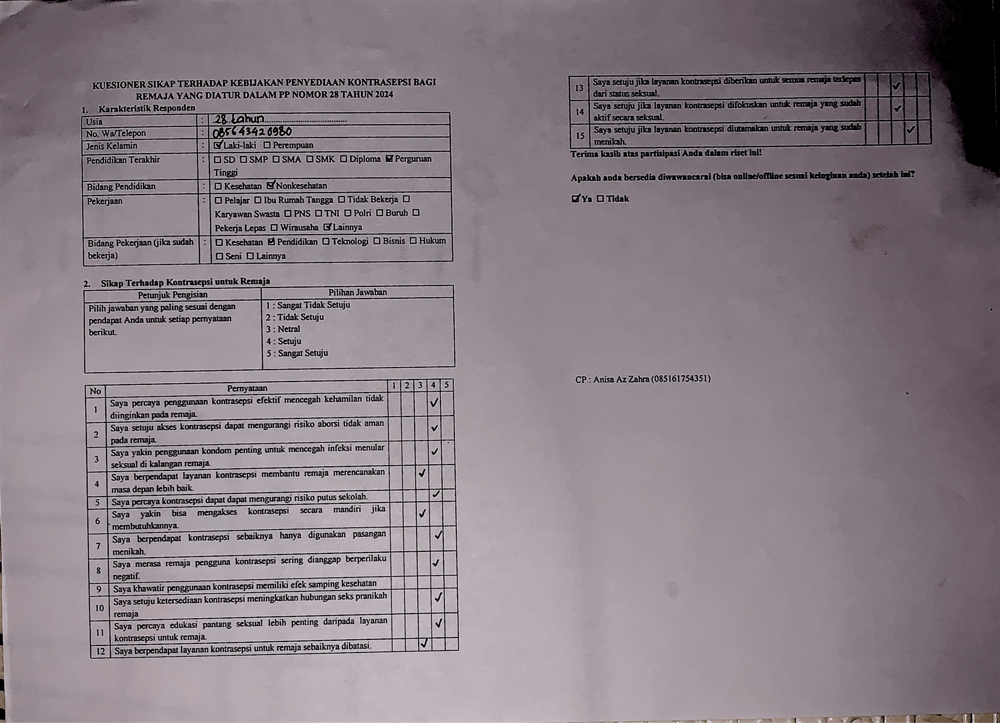

 

   

  ---
  
  <h3 align="center">Questract (Prototype)</h1>

  

    <strong>Optical Mark Recognition (OMR) Engine with Computer Vision</strong>
     
    <em>An engineering study on digitizing physical questionnaires into JSON.</em>
  

> [!WARNING]
> **PROJECT ARCHIVED**
>  
> This project was developed in **September 2025** and is now **Read-Only**.
> It was built to solve a specific research bottleneck but was eventually halted due to a pivot in the research methodology. The code remains available as a case study in **Coordinate Mapping** and **Computer Vision** algorithms.

---

  
Table of Contents

  <ol>
    <li>
      <a href="#context--the-problem">Context & The Problem</a>
      <ul>
        <li><a href="#built-with">Built With</a></li>
      </ul>
    </li>
    <li><a href="#technical-deep-dive">Technical Deep Dive</a></li>
    <li><a href="#-proof-of-concept">Proof of Concept</a></li>
  </ol>

## Context & The Problem

**Questract** was born from a real-world data entry bottleneck.

A Psychology researcher was conducting a study on a sensitive topic (**contraceptive usage**) and required physical paper forms to ensure respondent privacy and comfort. This resulted in over **100+ handwritten pages** that needed to be digitized.

Watching the manual entry process—moving data from paper to Excel one by one—I realized this was a scalability problem. The hypothesis was simple: **Since the form layout is static (template-based), we should be able to map the coordinates once and automate the reading process.**

### The Technical Pivot (Why it stopped)
The prototype successfully processed flat-bed scans using a JSON coordinate blueprint. However, in real-world scenarios, mobile photography introduced **geometric distortions** (paper curling, perspective warping, and lighting shadows).

While I researched advanced solutions like *DewarpNet (Single-Image Document Unwarping)* to flatten the images digitally, the research timeline was tight. The researcher eventually pivoted the data collection method, removing the need for this tool. I decided to archive the project here rather than leaving it unfinished, documenting the "Coordinate Blueprint" logic which remains a valid solution for flat-scan OMR.

(<a href="#readme-top">back to top</a>)

### Build With
* [![Python][Python]][Python-url]
* [![OpenCV][OpenCV]][OpenCV-url]
* [![Streamlit][Streamlit]][Streamlit-url]

(<a href="#readme-top">back to top</a>)

## Technical Deep Dive

This repository demonstrates three key engineering concepts used to solve the OMR problem:

### 1. JSON-Based Coordinate Blueprint
Instead of hardcoding pixel values, the system relies on a **Config-Driven Architecture**. The layout of the questionnaire is defined in a separate JSON file (`generated_config.json`). This makes the engine agnostic; it doesn't care *what* the form asks, it only cares *where* the boxes are.

### 2. Automated Coordinate Discovery
Mapping hundreds of checkboxes manually is tedious. I built an internal tool (`scripts/automated_finder.py`) that utilizes **Contour Detection** to scan a blank template. It automatically identifies square shapes, filters them by aspect ratio, and generates the coordinate JSON blueprint in seconds.

### 3. Adaptive Thresholding Logic
The engine doesn't just look for black pixels. It calculates the **pixel density** within a specific Region of Interest (ROI).
* It handles variations in pen thickness and scan contrast.
* It distinguishes between "noise" (scanner dust) and a valid "check mark" using dynamic thresholding.

(<a href="#readme-top">back to top</a>)

## 📸 Proof of Concept

Below is the visualization of the engine in action before the project was archived.

**1. Input Processing & Visual Debugging**
The system visualizes the "Robot's Eye View"—drawing bounding boxes (Green/Red) over the original image to verify detection accuracy in real-time.

**2. Final Output (Digitization)**
The raw pixel data is successfully converted into a clean, structured JSON format ready for database entry.

(<a href="#readme-top">back to top</a>)

 

  <small>
    Developed by 
    <a href="https://www.linkedin.com/in/USERNAME-KAMU">
      Firyan Fatih Fadilah
    </a>
    as a Mini-Research Project.
  </small>

<!-- MARKDOWN LINKS & IMAGES -->
<!-- https://www.markdownguide.org/basic-syntax/#reference-style-links -->
[product-screenshot]: images/screenshot.png
[Python]: https://img.shields.io/badge/Python-000000?style=for-the-badge&logo=python
[Python-url]: https://www.python.org
[OpenCV]: https://img.shields.io/badge/OpenCV-000000?style=for-the-badge&logo=opencv
[OpenCV-url]: https://opencv.org/
[Streamlit]: https://img.shields.io/badge/Streamlit-000000?style=for-the-badge&logo=Streamlit
[Streamlit-url]: https://streamlit.io/
